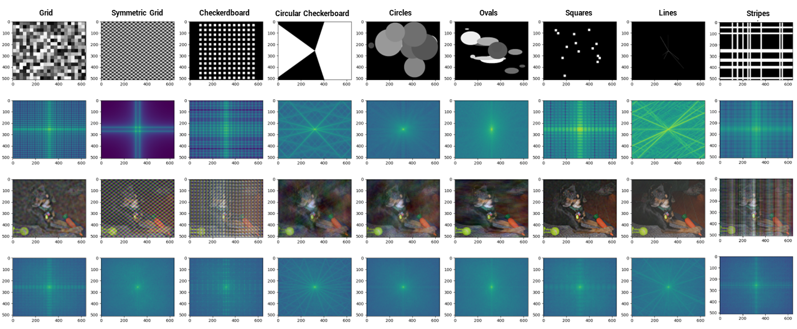
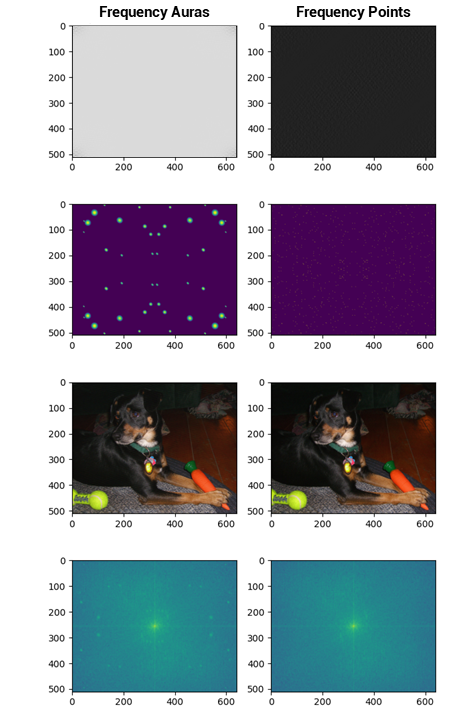
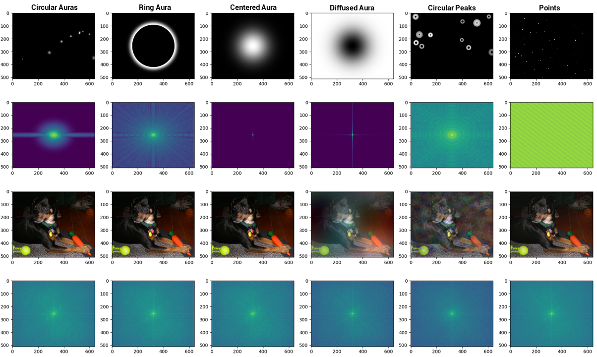

# Deepfake Detection without Deepfakes: Generalization via Synthetic Frequency Patterns Injection

Published on Computer Vision and Image Understanding (CVIU)

<p align="center">
  
</p>

<table align="center" width="100%">
  <tr>
    <td width="6%"></td>
    <td width="30%" align="right">
      
    </td>
    <td width="2%"></td>
    <td width="68%" align="left">
      
    </td>
  </tr>
</table>

Deepfake detectors are typically trained on large sets of pristine and generated images, resulting in limited generalization capacity; they excel at identifying deepfakes created through methods encountered during training but struggle with those generated by unknown techniques.
This paper introduces a learning approach aimed at significantly enhancing the generalization capabilities of deepfake detectors. Our method takes inspiration from the unique ``fingerprints'' that image generation processes consistently introduce into the frequency domain. These fingerprints manifest as structured and distinctly recognizable frequency patterns. We propose to train detectors using only pristine images injecting in part of them crafted frequency patterns, simulating the effects of various deepfake generation techniques without being specific to any. These synthetic patterns are based on generic shapes, grids, or auras.
We evaluated our approach using diverse architectures across 25 different generation methods. 
The models trained with our approach were able to perform state-of-the-art deepfake detection, demonstrating also superior generalization capabilities in comparison with previous methods. Indeed, they are untied to any specific generation technique and can effectively identify deepfakes regardless of how they were made.

## How to run

This repository revolves around three main scripts:

- `train.py`: train a detector from CSV-based splits
- `test.py`: evaluate a trained checkpoint or run inference
- `generation/generate_images.py`: generate synthetic images from captions with Stable Diffusion

Before running the project, make sure you have:

- Python with the required ML libraries installed (`torch`, `torchvision`, `timm`, `albumentations`, `opencv-python`, `pandas`, `scikit-learn`, `PyYAML`, `diffusers`, `accelerate`)
- a YAML config file with `model`, `training`, and `test` sections
- CSV files describing your splits

Expected CSV columns:

- `path`: relative image path
- `label`: `0` for pristine, `1` for fake
- `method`: optional for evaluation, useful for per-method analysis in `test.py`

Minimal training example:

```bash
python train.py \
  --config path/to/config.yaml \
  --training_csv path/to/train.csv \
  --validation_csv path/to/val.csv \
  --data_path path/to/data \
  --models_output_path models \
  --model 1 \
  --use_fake_patterns \
  --required_pattern 0
```

Useful options:

- `--model 0`: ResNet50
- `--model 1`: Swin
- `--use_fake_patterns`: inject synthetic frequency patterns during training
- `--only_pristines`: train only from pristine images
- `--pollute_pristines`: inject patterns into part of the pristine set and relabel them as fake
- `--required_pattern 0`: all patterns
- `--required_pattern 1`: geometric patterns
- `--required_pattern 2`: aura / peak patterns
- `--required_pattern 3`: Fourier-inspired patterns

Minimal testing example:

```bash
python test.py \
  --config path/to/config.yaml \
  --model_weights path/to/checkpoint \
  --correct_labels_csv path/to/test.csv \
  --test_folder path/to/test_root \
  --data_folder path/to/data_root \
  --output_path outputs/predictions.json \
  --model 1
```

If `--correct_labels_csv` is omitted, `test.py` can be used for inference only.

